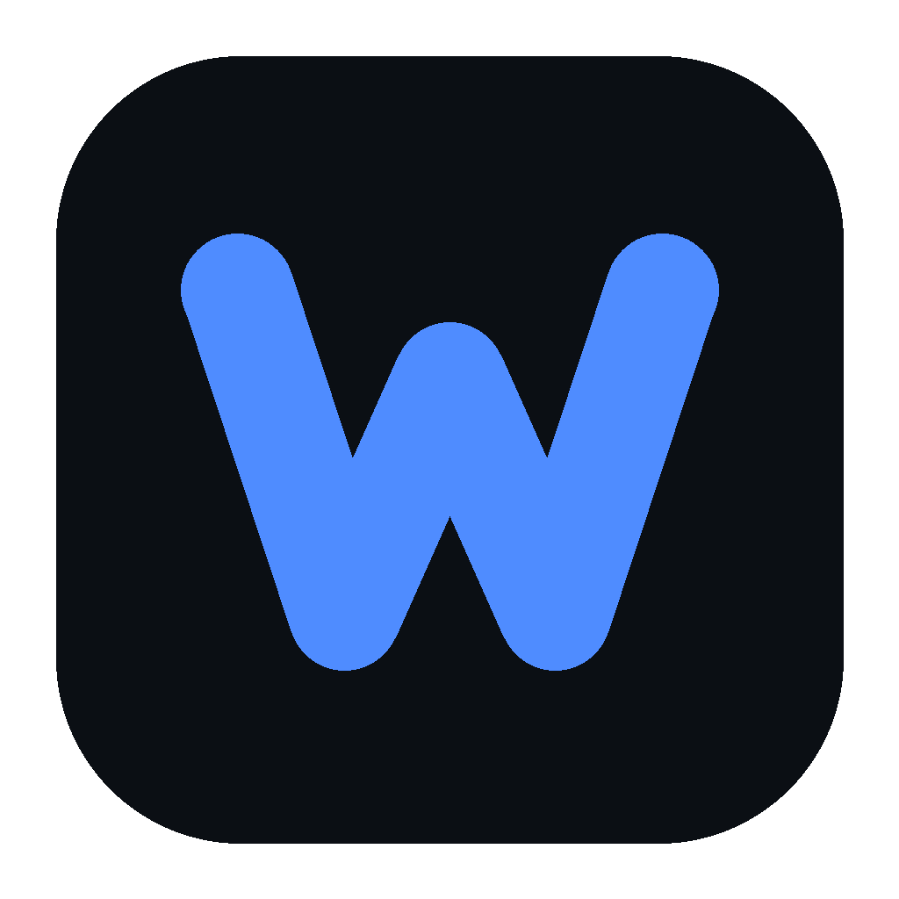
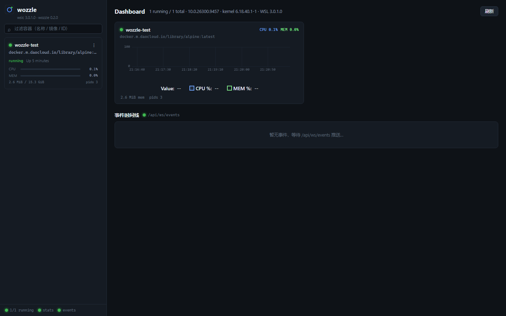
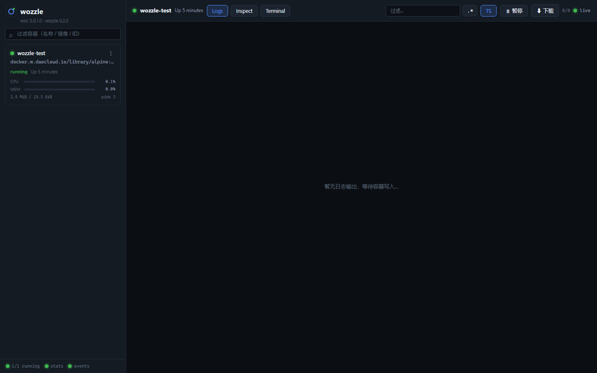
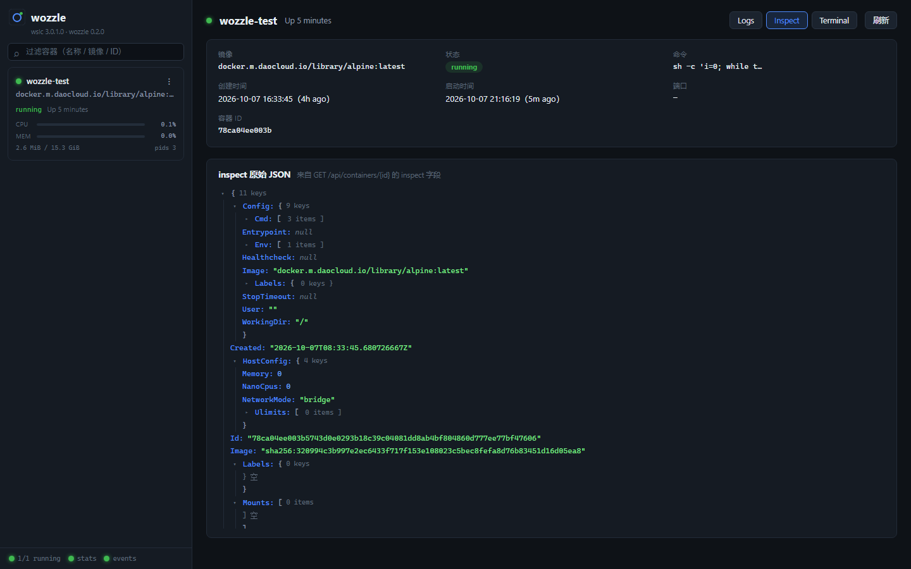
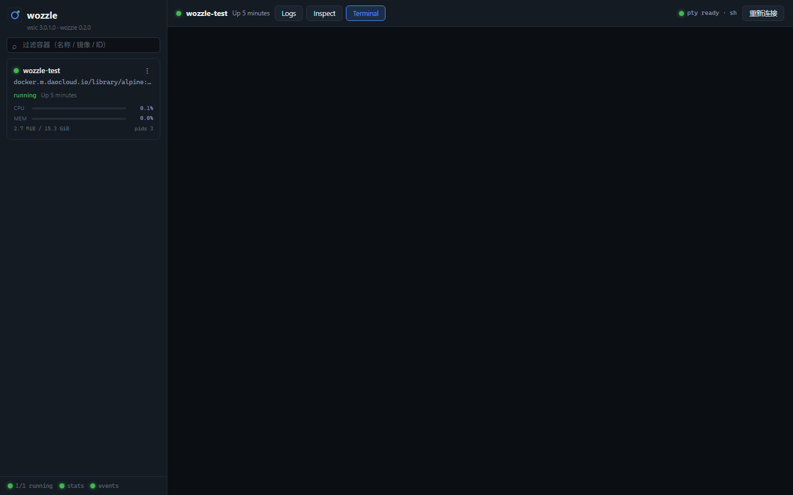

# Wozzle

> Monitor **WSL 3.0 native containers** (`wslc`) in real time — live logs, resource charts, container events and a web terminal — the way [Dozzle](https://github.com/amir20/dozzle) does it for Docker. Ships as a **single exe** with the web UI embedded.



## Screenshots

| Dashboard | Live logs |
|:---:|:---:|
|  |  |

| Inspect | Terminal |
|:---:|:---:|
|  |  |

## Features

- **Live log streaming** — `wslc logs -f` bridged to the browser: timestamps, regex/text filtering, pause/resume, download, auto-reconnect, and stream resumption across container restarts
- **Resource monitoring** — CPU / memory / network / block I/O / PIDs, refreshed every 2 s with rolling dashboard charts
- **Event stream** — `wslc events` pushed live; the container list refreshes instantly
- **Web terminal** — xterm.js wired straight to `wslc exec -i -t`
- **Container control** — start / stop / kill / restart / remove, behind confirmation dialogs
- **Desktop experience** — system tray + native WebView2 window, with an optional headless server mode

## Requirements

- Windows 10/11 with **WSL 3.0+** (`wsl --version` reporting 2.9.3 or higher; GA builds recommended)
- `wslc.exe` on PATH — ships with WSL at `C:\Program Files\WSL\wslc.exe`
- Containers running under WSL containers (`wslc run ...`). If Docker Hub is unreachable, pull from a mirror, e.g. `wslc pull docker.m.daocloud.io/library/alpine`

## Build & Run

**Desktop mode (default)** — double-click `wozzle.exe`:

- Tray icon + standalone WebView2 window
- Closing the window keeps the process alive in the tray (right-click: Open Panel / Open in Browser / Start with Windows / Quit)
- Logs are written to `~\.wozzle\wozzle.log`

**Listen address** (priority: `-addr` flag > `WOZZLE_ADDR` env var > `wozzle.json` next to the exe > default `127.0.0.1:8080`):

```json
{
  "addr": "127.0.0.1:9090",
  "openBrowser": false
}
```

**Headless mode** (no tray/window, console logging):

```powershell
.\wozzle.exe -headless
.\wozzle.exe -headless -addr 0.0.0.0:8080   # LAN access — note: no auth, be careful
```

**Build from source** (Go 1.26+):

```powershell
# desktop build (no console window)
go build -ldflags "-H windowsgui" -o wozzle.exe .
# console / dev build
go build -o wozzle-console.exe .
```

Frontend rebuild (needed after UI changes; output is embedded into the exe):

```powershell
cd web
pnpm install
pnpm build
cd ..
go build -ldflags "-H windowsgui" -o wozzle.exe .
```

Development: terminal 1 `go run . -headless`, terminal 2 `cd web; pnpm dev` (Vite proxies `/api` → `127.0.0.1:8080`).

## Architecture

```
Browser (Vue3 + xterm.js + uPlot)
   │ HTTP / WebSocket  (contract: docs/API.md)
wozzle.exe (Go, single binary, frontend embedded)
   │ child processes + JSON / streamed stdout
wslc.exe ── list / stats / logs -f / events / exec -i -t
   │
WSL container engine (session manager)
```

- `internal/wslc` — wslc CLI wrapper and JSONL parsing (raw samples in `docs/schema/`)
- `internal/store` — container inventory (2 s polling + event-driven refresh)
- `internal/server` — REST + 4 WebSocket channels; log stream supervisor (ring-buffer backfill, stream reconnection)
- `internal/desktop` — tray (getlantern/systray), WebView2 window (go-webview2), autostart (registry Run key), console attach
- `internal/config` — `wozzle.json` settings
- `web/` — Vue 3 frontend
- `tools/wssmoke` — end-to-end WebSocket smoke tests (`go run ./tools/wssmoke`, expects a running `wozzle-test` container); `tools/genicon.py` regenerates the icon

## Known limitations

- The exec terminal **cannot resize mid-session** (wslc CLI limitation; `resize` messages are ignored, initial rows/cols are passed via `COLUMNS`/`LINES`)
- After closing the desktop window, reopen it from the tray; if WebView2 recreation fails it falls back to the system browser (the WebView2 runtime is preinstalled on Windows 10/11)
- Stats are 2-second polling snapshots (`wslc stats` has no streaming mode)
- Binds to `127.0.0.1` by default with no authentication — keep it local

## Documentation

- [docs/API.md](docs/API.md) — REST / WebSocket contract (single source of truth)
- [docs/schema/](docs/schema/) — raw `wslc` JSON output samples
